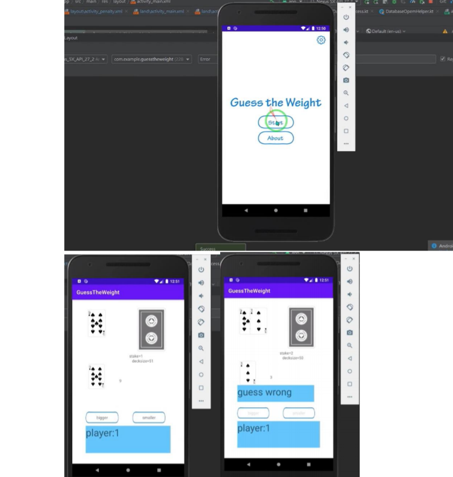
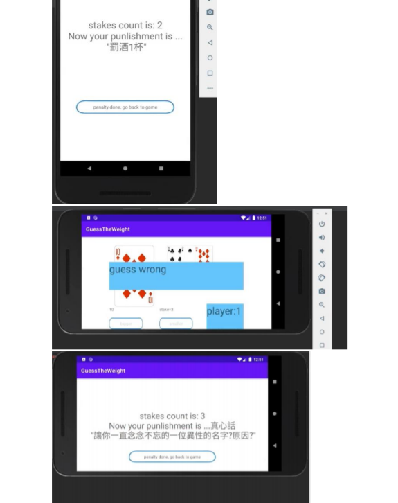

# GuessTheWeight 
 GuessTheWeight是一個適合喝酒時玩的遊戲。玩家人數4~6人， 
 遊戲規則: 
 遊戲一開始先從牌堆翻一張牌出來，接下來選一位朋友開始遊戲。 
 這位朋友必須猜牌堆上方的下一張牌比翻出來的牌大或小。 
 猜對兩次就可以換下一位朋友。 
 每猜對一次桌上翻出來的牌數就會增加一張。 
  
 如果猜錯則依照桌上累積的牌數進行懲罰。 
 懲罰: 
 2張->喝1口酒 
 3張->真心話 
 4張->喝2口酒(每2張喝1口酒 積累) 
 5張->大冒險 
 6張以上->喝(牌數/2取下高斯)口酒 + 真心話 -> 清空當前牌數 

 
demo： 
  
  
 
